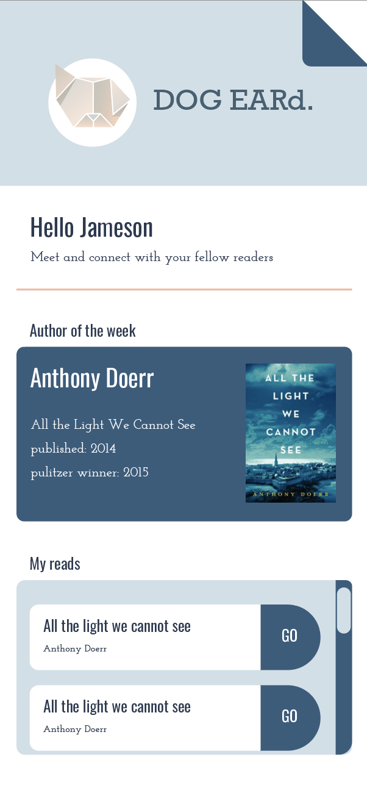

1. Download project directory locally
2. Start mongo db
3. Go to project directory
4. Run npm install
5. In the terminal navigate to /server subfolder
6. Run 'nodemon server.js'
7. In another terminal window, in the main project directory, run 'npm start' 

# DOG EARd
A mobile first application for book-lovers. Users can add books to their profile and be matched with people who have similar tastes. 

<kbd>

</kbd>

## User Story 
```
AS A book enthusiast 
I WANT to connect with those with similar reading tastes
SO THAT I can discuss books with other users in real time and enhance my reading experience
```

## Functionality 
```
WHEN I visit the application
THEN I am able to create a new account, or log into an existing account
WHEN I log into my account
THEN I am presented with a home screen showing me information about my books and book-add options
WHEN I select a new book
THEN it is added to my book collection
WHEN I click on one of my selected books
THEN I can view and communicate with my matched readers
```

## Credits
This MERN application uses [React](https://reactjs.org/), [Express](https://www.npmjs.com/package/express), [Node](https://nodejs.org/en/), [MongoDB](https://www.mongodb.com/), [Mongoose](https://www.npmjs.com/package/mongoose/), [Framer](https://www.framer.com/), and [node-cron](https://www.npmjs.com/package/cron).
 

## Contributors
A collaboration between [Kim Credit](https://github.com/kimcredit), [Benedicta Kim](https://github.com/benedictakim), [Jessica Yoo Perry](https://github.com/jessyoo), and [Michael Shattuck](https://github.com/mshattuck).
  

## License
Copyright (c) 2020 Kim Credit.